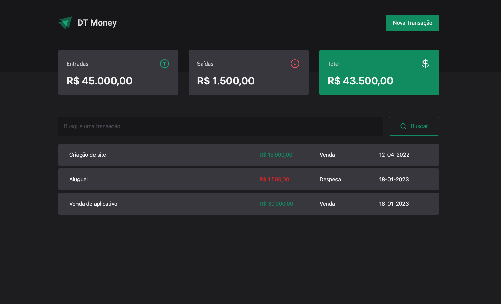

# DtMoney APP

- Desenvolvi essa aplicação como fins de estudo mesmo para praticar conceitos do Nuxt 3 e VueJS
- A aplicação consiste em um sistema de controle financeiro simples, onde o usuario pode cadastrar transacoes de recebimento ou despesa
- Tem uma dashboard mostrando o total de cada tipo de transação , alem de um total geral mostrando quanto o usuario tem em caixa.

<br>
<br>
<br>



<br>
<br>
<br>

<p>Essa aplicação foi disponibilizada no curso IGNITE da <a href="https://lp.rocketseat.com.br/ignite">RocketSeat</a>, no curso ela é feita utilizando o Framework ReactJS, porem como eu esto focando na stack do vue, reslvi desenvolver utilizando minhas stacks principais. Como mais um desafio, resolvi tambem testar pela primeira vez o Pinia para gerenciar os estados de minha aplicação no lugar do VUEX. O Vue js hoje recomenda o Pinia, e achei até mais interessante, e ate mais facil pra configurar no nuxt, e usar o typescript</p>

<p>A aplicação possui tambem um <a href="https://github.com/cfcamargo/dtmoney-backend">back-end</a>, que foi desenvolvido usando AdonisJS, com o MySQL como banco de dados. O back end é um CRUD simples, que cria, lista, edita e exclui os dados do banco. Estou no momento focado em me tornar um full stack, e com isso começei a estudar essa parte.</p>

<br><br><br>

## Tecnologias
- <a href="https://nuxt.com/">Nuxt 3</a>
- <a href="https://vuejs.org/">Vue JS</a>
- <a href="https://nuxt.com/modules/tailwindcss">Tailwind CSS ( Modulo do Nuxt )</a>
- <a href="https://pinia.vuejs.org/">Pinia</a>
- <a href="https://www.typescriptlang.org/">Typescript</a>

<br>
<br>
<br>
<br>


# Setup Projeto


# Nuxt 3 Minimal Starter

Look at the [Nuxt 3 documentation](https://nuxt.com/docs/getting-started/introduction) to learn more.

## Setup

Make sure to install the dependencies:

```bash
# yarn
yarn install

# npm
npm install

# pnpm
pnpm install
```

## Development Server

Start the development server on http://localhost:3000

```bash
npm run dev
```

## Production

Build the application for production:

```bash
npm run build
```

Locally preview production build:

```bash
npm run preview
```

Check out the [deployment documentation](https://nuxt.com/docs/getting-started/deployment) for more information.
